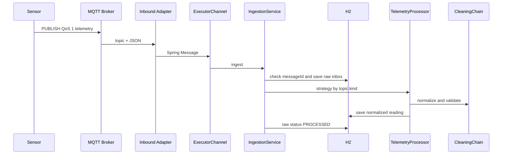
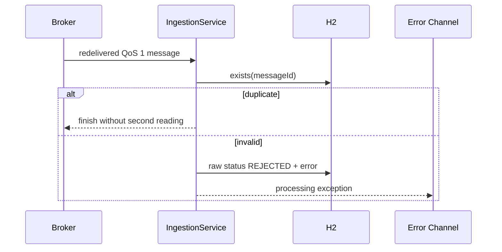
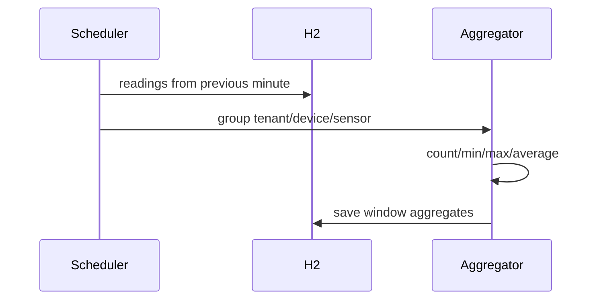

# Sequences

## Telemetry ingestion

```mermaid
sequenceDiagram
 Sensor->>MQTT Broker: PUBLISH QoS 1 telemetry
 MQTT Broker->>Inbound Adapter: topic + JSON
 Inbound Adapter->>ExecutorChannel: Spring Message
 ExecutorChannel->>IngestionService: ingest
 IngestionService->>H2: check messageId and save raw inbox
 IngestionService->>TelemetryProcessor: strategy by topic kind
 TelemetryProcessor->>CleaningChain: normalize and validate
 TelemetryProcessor->>H2: save normalized reading
 IngestionService->>H2: raw status PROCESSED
```

## Duplicate and failure

```mermaid
sequenceDiagram
 Broker->>IngestionService: redelivered QoS 1 message
 IngestionService->>H2: exists(messageId)
 alt duplicate
  IngestionService-->>Broker: finish without second reading
 else invalid
  IngestionService->>H2: raw status REJECTED + error
  IngestionService-->>Error Channel: processing exception
 end
```

## Aggregation

```mermaid
sequenceDiagram
 Scheduler->>H2: readings from previous minute
 Scheduler->>Aggregator: group tenant/device/sensor
 Aggregator->>Aggregator: count/min/max/average
 Aggregator->>H2: save window aggregates
```
